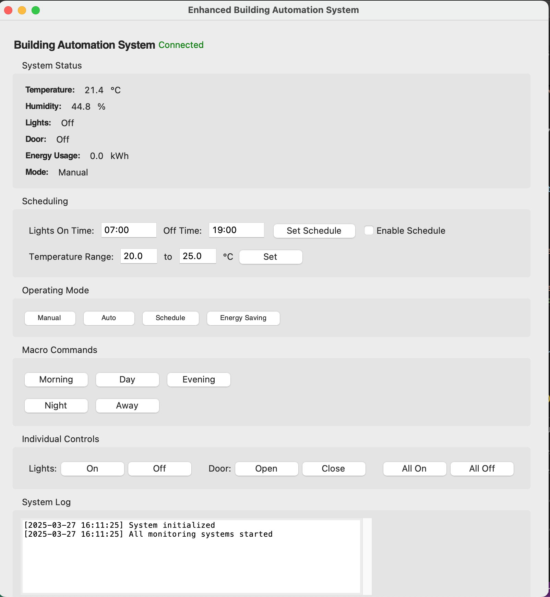

# **Enhanced Building Automation System (BAS)**  

<p align="center">
  
</p>

## 📌 Overview  

The **Enhanced Building Automation System (BAS)** is designed to intelligently manage building equipment, including lighting, temperature, and access control. It integrates **real-time monitoring, smart scheduling, and automated decision-making** to improve energy efficiency, reduce costs, and enhance user convenience.  

## 🚀 **Key Features**  

- **Smart Scheduling** – Automates lighting and temperature control.  
- **Real-Time Monitoring** – Tracks temperature, humidity, and energy usage.  
- **Multiple Operating Modes**:  
  - **Manual** – Full user control.  
  - **Auto** – Adjusts settings based on sensor data.  
  - **Schedule** – Time-based automation.  
  - **Energy Saving** – Optimized consumption to reduce costs.  
- **Macro Commands** – Predefined modes for different times of the day (Morning, Night, Away, etc.).  
- **Lighting & Door Controls** – Instant adjustments for security and efficiency.  
- **System Logging** – Tracks all activities for monitoring and analysis.  

## 🌍 **Deployment Potential**  

Ideal for **smart homes, commercial buildings, industrial facilities, and educational institutions**, BAS can help reduce operational costs while enhancing comfort.  

### 🔮 **Future Enhancements**  
🔹 AI-powered predictive analytics for smarter energy management.  
🔹 IoT integration for remote access via cloud or mobile app.  
🔹 Voice and gesture control for hands-free operation.  

## 🔧 **Installation & Setup**  

1️⃣ **Clone the Repository**  
```sh
git clone https://github.com/allmen/Building-Automation-System.git
cd BAS_Automation_System
```  
2️⃣ **Install Dependencies**  
```sh
pip install -r requirements.txt
```  
3️⃣ **Run the Application**  
```sh
python src/BAS_Controller.py
```  
